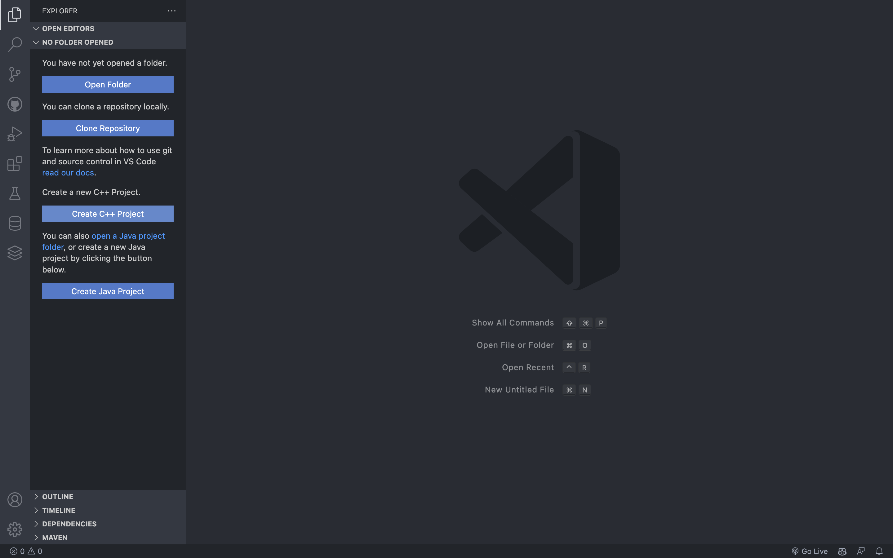
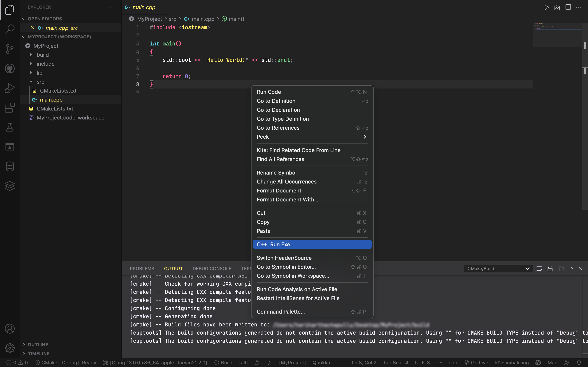

# C++ Project manager

An extension that simplifies the proccess of creating and managing C++ projects,   configures them and deals with the CMake side of things for you.

## Features

### New Project

### New Class

### Configure
Rescan and add "c"/"cpp" files with include directories to CMakeLists.txt.  
Type "C++: Configure" in the command pallette.

### Run Exe

## Requirements

- 'code' added to PATH
- vscode 1.62.0+
- Make sure to open a project workspace for the extension to work
- [CMake Tools extension](https://marketplace.visualstudio.com/items?itemName=ms-vscode.cmake-tools)

>Code can be added to path by opening the command pallette (Cmd + Shift + P) and typing "Shell Command: Install 'code' command to PATH"

## LICENSE

This extension follows the [MIT](https://github.com/DarkEmbers/cpp-project-manager/blob/master/LICENSE) license

## Known Issues

Please report your issues at: [C++ Project Manager Github Page](https://github.com/DarkEmbers/cpp-project-manager/issues)

## Release Notes

## 1.1.0

- Fixed Windows support and cross compatibility
- Changed Run to use CMakeTools